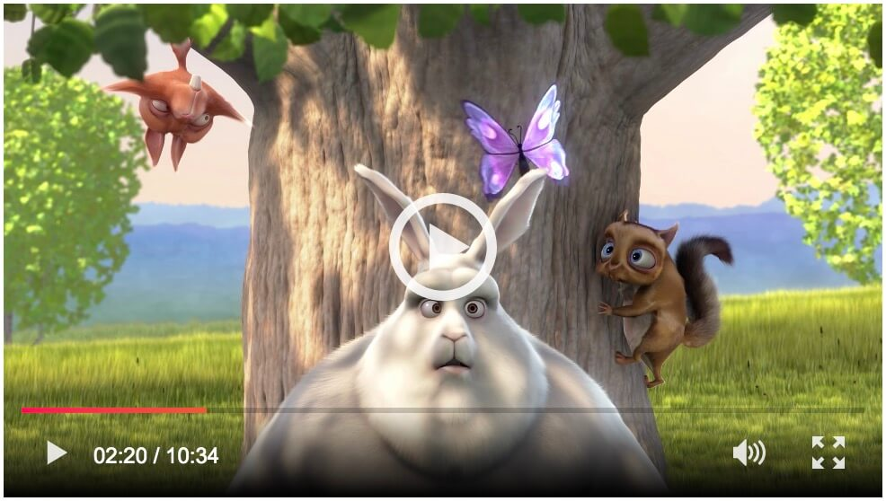

title: How it works - vLitejs
description: The project includes a minimalist HTML structure example to start your video player. All options are listed here and can be changed in the constructor

## HTML structure

vLitejs use native HTML5 `video` tag. The syntax is the same between HTML5 and Youtube player, with only a data attribute `data-youtube-id` for Youtube, that's all.<br />

Replace `{{idSelector}}` with a unique id and `{{videoId}}` with the identifiant of the Youtube video.

!!! warning "HTML"
    For information, each video players must have inevitably a __unique id__ in data attribute.

### HTML5 video

```html
<video id="{{idSelector}}"
    class="vlite-js"
</video>
```

### Youtube video

```html
<video id="{{idSelector}}"
    class="vlite-js"
    data-youtube-id="{{videoId}}">
</video>
```

<br /><p align="center">
    <a href="https://yoriiis.github.io/vlitejs/demo" title="Demo" class="custom-button">
        
    </a>
</p>

## Options

Each players has its own object of options. For more flexibility, vLitejs accepts two possibilities for passed them.

!!! warning "Only one or the other"
    Don't pass options in the HTML in adition to the Javascript constructor. If you choose to do it, there will be a __conflict__, and the priority will be given to options pass by the data attribute `data-options` in the HTML.

#### Options in the HTML

Object of options must be a valid JSON and write between single quote in data attribute `data-options` to prevent conflict, like the example below:

```html
<video id="player"
    class="vlite-js"
    src="video.mp4"
    data-options='{"autoplay": false, "controls": true}'>
</video>
```

#### Option in the Javascript constructor

Object of options passed to the constructor like the example below.

```javascript
new vlitejs({
    selector: '#player',
    options: {
        'autoplay': false,
        'controls': true
    }
});
```

#### Available options

Example below list all options with default value, change them according to your needs for each video players.


#### `autoplay`

`boolean = false`

Tells vLitejs whether to personalize the autoplay of the video.

```javascript
new vlitejs({
    options: {
        'autoplay': true
    }
});
```

#### `controls`

`boolean = true`

Tells vLitejs whether to personalize the control bar of the video.

```javascript
new vlitejs({
    options: {
        'controls': false
    }
});
```

#### `playPause`

`boolean = true`

Tells vLitejs whether to personalize the play/pause button on the control bar.

```javascript
new vlitejs({
    options: {
        'playPause': false
    }
});
```

#### `time`

`boolean = true`

Tells vLitejs whether to personalize the time information on the control bar.

```javascript
new vlitejs({
    options: {
        'time': false
    }
});
```

#### `timeline`

`boolean = true`

Tells vLitejs whether to personalize the timeline on the control bar.

```javascript
new vlitejs({
    options: {
        'timeline': false
    }
});
```

#### `volume`

`boolean = true`

Tells vLitejs whether to personalize the volume button on the control bar.

```javascript
new vlitejs({
    options: {
        'volume': false
    }
});
```

#### `fullscreen`

`boolean = true`

Tells vLitejs whether to personalize the fullscreen button on the control bar.

```javascript
new vlitejs({
    options: {
        'fullscreen': false
    }
});
```

#### `poster`

`null`

Tells vLitejs whether to personalize the poster url of the video.

```javascript
new vlitejs({
    options: {
        'poster': 'poster.jpg'
    }
});
```

#### `bigPlay`

`boolean = true`

Tells vLitejs whether to personalize the big play button on the control bar.

```javascript
new vlitejs({
    options: {
        'bigPlay': false
    }
});
```

#### `autoHide`

`boolean = false`

Tells vLitejs whether to auto hide the control bar if the user is inactive.

```javascript
new vlitejs({
    options: {
        'autoHide': true
    }
});
```

#### `nativeControlsForTouch`

`boolean = false`

Tells vLitejs whether to keep native controls for touch devices.

```javascript
new vlitejs({
    options: {
        'nativeControlsForTouch': true
    }
});
```

## Instantiation

Instantiation of native HTML5 video and Youtube video is the same. The difference is made by the presence of the data attribute `data-youtube-id`.<br />

The vLitejs class accept an object parameter with three keys:

* `selector` - Selector of the video element (mandatory)
* `options` - Object of options (optional)
* `callback` - Callback function (optional)

!!! info "Selector"
    The selector can be a string with unique identifier or an HTML element with `document.querySelector('#player')`.

#### Simple example with options in HTML

The simplest way to use vLitejs is like the example below.<br />
All default options are used except the `poster` was override in the example below:

```html
<video id="{{idSelector}}"
    class="vlite-js"
    data-options='{"poster": "poster.jpg"}'>
</video>
```

```javascript
new vlitejs({
    selector: '#player'
});
```

#### Example with the callback function and options in the constructor

The callback function is called when the current player is instanciated and ready. The function expose the `player` instance. See below for available methods.

```html
<video id="{{idSelector}}"
    class="vlite-js"
</video>
```

```javascript
new vlitejs({
    selector: '#player',
    options: {
        "poster": "poster.jpg"
    },
    callback: (player) => {
        //Ready
    }
});
```

## Load Youtube API

Youtube API is automatically loaded by vLitejs when a Youtube player is instanciated. All players are instanciate when the API is ready with a queuing system.

<script>
  ((window.gitter = {}).chat = {}).options = {
    room: 'vlitejs/vlitejs'
  };
</script>
<script src="https://sidecar.gitter.im/dist/sidecar.v1.js" async defer></script>