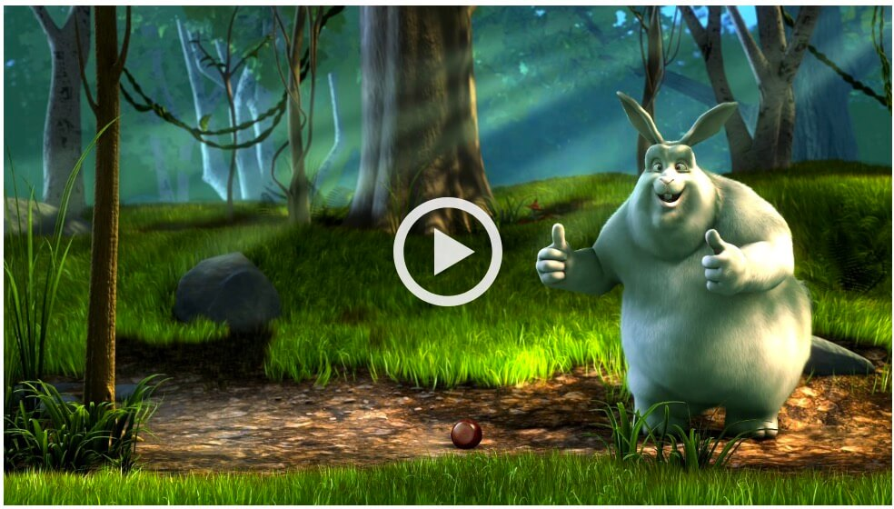

title: vLitejs - Customize HTML5 and Youtube video with Javascript and CSS | Yoriiis
description: vLitejs is a fast and lightweight Javascript library to customize and skin native HTML5 video and Youtube video in Javascript native with a default skin

# vLitejs

## The new smallest Javascript video library

vLitejs is a **fast** and **lightweight** Javascript library to customize and skin native HTML5 video and Youtube video. Only **5Kb** on production with gzip, vLitejs has no dependency with any framework or library and is write in **Javascript native**. 

 

    

 

## Github & npm

The plugin is available as the `vlitejs` package name on [npm](https://www.npmjs.com/package/vlitejs) and [Github](https://github.com/yoriiis/vlitejs). 
If you like the project, like it on Github please 😃  
<a class="github-button" href="https://github.com/yoriiis/vlitejs" data-icon="octicon-star" data-size="large" data-show-count="true" aria-label="Star yoriiis/vlitejs on GitHub">Star</a>

## Browser support

The project is fully compatible with the most popular web browsers. More information about the HTML5 video support on <a href="https://caniuse.com/#feat=video" target="_blank" title="Video element - Can I use">Can I Use</a>. HTML and CSS files are W3C valid.

## Licence

`vLitejs` and his documentation are licensed under the [MIT License](http://opensource.org/licenses/MIT). 
Created with ♥ by [@yoriiis](http://github.com/yoriiis).

## Contributors

!!! note "Contributors"
    Many thanks to Maxime LEROUGE for its contribution.

